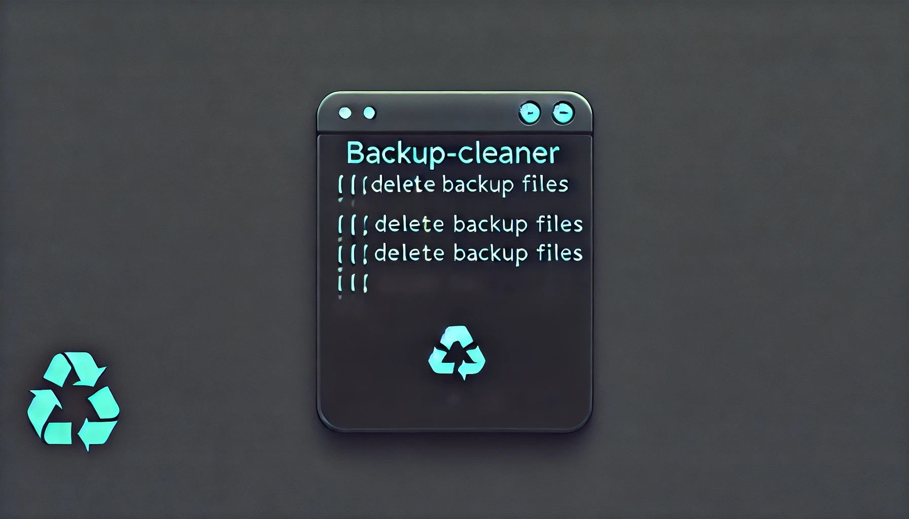

   
  
   
  Configurable command-line tool for easily deleting unnecessary backup files.

## Backup cleaner

This app removes redundant backup copies and frees up space on your disk.

cargo run -- -p 1d-5 -f /Users/constantine/Projects/Rust/Backups -r "(\d{2}).(\d{2}).(\d{4})"

### How it works

1. Create .env file to config
2. Cron it up

### Config
period + qnt